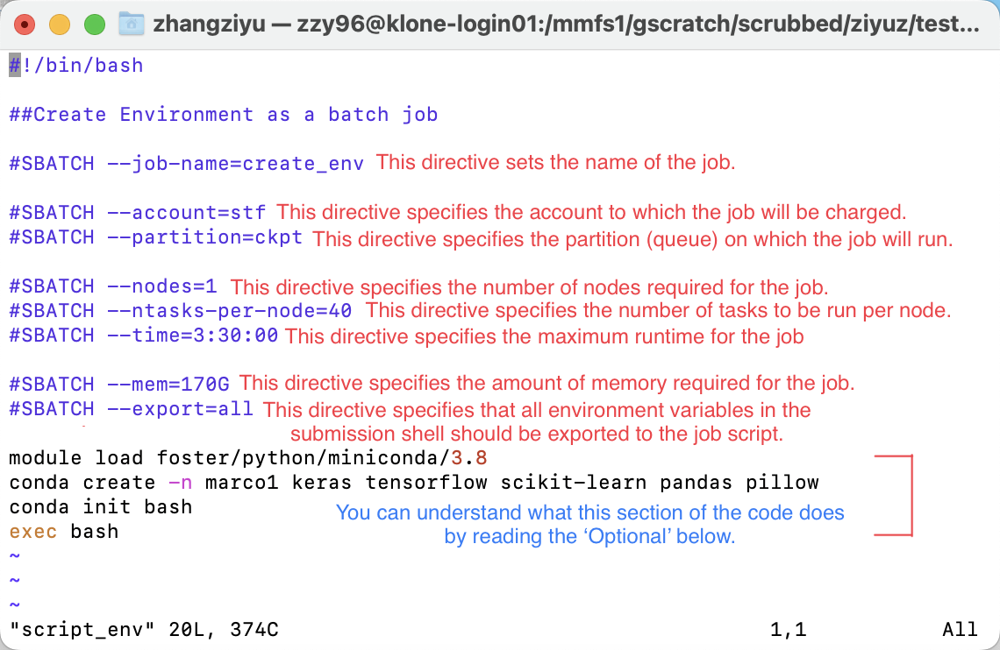

# MSE544_Week2_Hands_on

## Hands-on 2: Train a convolutional neural network (CNN) with MARCO data on Hyak

Authors: Ting Cao & [Ziyu Zhang](https://github.com/Ilxxll)

### Table of Content

- [Background & Goals](#background)
- [Train a CNN with MARCO data on Hyak](#train)
  - [Step 1: Get familiar with the convolutional neural network.](#step1)
  - [Step 2: Convert the training part into a python script file.](#step2)
  - [Step 3: Configure Marco1 Environment.](#step3)
  - [Step 4: Evaluate the model.](#step4)
- [Submission](#submission)

## Background & Goals for this week's hands-on 

#### Convolutional Neural Network (CNN) & MARCO

CNN (Convolutional Neural Network) is a deep learning algorithm commonly used for image and video recognition tasks, that uses convolutional layers to automatically learn and extract features from input data.

MARCO is a dataset of protein crystal images, with four categories: Clear, Crystals, Other,
Precipitate. In this session we will use only a subset of it, with 20000 images (each
category has 5000 images).

You can learn what is CNN and MARCO from the fall quarter lecture in the [canvas page](https://canvas.uw.edu/courses/1631767/pages/week-2-using-hpc-and-github).

https://canvas.uw.edu/courses/1631767/pages/week-2-using-hpc-and-github

Additional resource: 

CNN: https://en.wikipedia.org/wiki/Convolutional_neural_network

MARCO: https://marco.ccr.buffalo.edu/about

#### Goals for this week's Hands-on

1. Train a convolutional neural network on Hyak platform, that can classify the images
from MARCO data into four categories: `Clear`, `Crystals`, `Other`, `Precipitate`.

2. Estimate the prediction accuracy of the trained model on a test dataset from MARCO.

## Train a CNN with MARCO data on Hyak 

### Before we start:

Please download: `crystal_image_processing.ipynb`, `marcodata.tar.gz`, `marco.py`, `script`,`script_env` from Canvas.

### Step 1: Get familiar with the convolutional neural network.

The python code is given in the jupyter notebook: `crystal_image_processing.ipynb`. Download it and read the code in it to get familiar with the code.

**If you have not taken CHEM 441, CHEM 541, MSE 477, or MSE 542 before, please run through this Jupyter notebook by yourself first.**

Download the compressed MARCO dataset `marcodata.tar.gz` from canvas, unzip it in your local computer. You will see a folder named `marcodata`,with each subfolder under it contains the images for each category.

#### Optional：

You can run the notebook locally to get more familiar with the code. **The training process may take very long time if you run it on your local computer.**

##### Note for setting up python environment on your local machine to run the notebook:

1. Make sure your have `anacond` or `miniconda` installed first.
https://conda.io/projects/conda/en/latest/user-guide/install/index.html. 

2. Then create a virtual environment by command:

`conda create -n envname keras tensorflow scikit-learn pandas pillow scikit-image`

`conda install -c conda-forge scikit-image`

This is to create an environment named ‘envname’ with all the specified python packages installed. Activate the environment by command:  `conda activate envname.` Then you should be ready to work with your notebook in this environment.

### Step 2: Convert the training part into a python script file.

To train the CNN on Hyak, you will need to copy the code from the jupyter notebook and put them into a python script file. The code up to the training part has been transferred to the python script file `marco.py` for you.

**Here you need to transferred the evaluate part to a script file `evaluate.py` by yourself.**

Hint: Remember to load the python packages, change the directory, and load the test dataset(df_test) in the correct data type (string).

### Step 3: Train the CNN as a batch job on Hyak.

#### Before we start:

- Create your own folder under **/gscratch/scrubbed/[Youruwnetid]** on Hyak.
  - Change Youruwnetid to your own uw-net-id.
- Upload `marco.py`, `script_env` ,`script`,`evaluate.py` to your folder on Hyak.

- **Scrubbed administrators will scrub files that have not been modified within 21 days. To avoid losing your files and results, make sure to download them to your local machine before this time period ends.**

- Use the following command to get the `marcodata.tar.gz` file to your own folder.
  - Change Youruwnetid to your own uw-net-id.
 
`cp /mmfs1/gscratch/stf/ziyuz/week2/marcodata.tar.gz  /mmfs1/gscratch/scrubbed/[Youruwnetid]/marcodata.tar.gz`
  

- Unzip the marcodata using the command: `tar -xf ./marcodata.tar.gz`, Make sure you're in the same directory as the `marcodata.tar.gz` before unzipping. After unzipping, you will see a folder named `marcodata`. 

#### Step 3-1: Configure the python environment on hyak.

you will need to use the slurm script `script_env` to confirgure your python environment as a batch job. The following image provides detailed information on `script_env` and the corresponding code it represents.

You can now submit your job using this command:
- `sbatch script_env`

If you want to check the status of your job in the queue, use the following command:  
- `squeue -u yourusername`
  - Change yourusername to your own user name

For more detail, read the Batch job section of this web page:
https://hyak.uw.edu/docs/compute/scheduling-jobs/

**Optional: Manual configure the python environment.**

**(Once you have completed the hands-on tutorial, you can try creating your own environment using this method.)** 

- `srun -p compute -A stf --nodes=1 --ntasks-per-node=40 --time=2:00:00 --mem=100G --pty /bin/bash`
  - You can use command to get an interactive node on hyak:
- `module load foster/python/miniconda/3.8`
  - This is to load the preinstalled anaconda on Hyak.
- `conda create -n myenv keras tensorflow scikit-learn pandas pillow`
  - This is to create a python environment named `myenv` with all needed python packages installed. 
- `conda init bash`
  - You will need to initiate conda if this is your first time using it on Hyak.
- `exec bash`
  - Restart bash to enable conda initiation.
- Press `ctrl + D`
  - Exit the current interactive session

For more detail, read this web page:
https://docs.conda.io/projects/conda/en/latest/user-guide/tasks/manage-environments.html#create-env-from-file

#### Step 3-2: Train the CNN as a batch job on Hyak.

Now you have your python code, the python environment and the data you need. Now you can start your training .

#### a. Change the parameter for the slrum script:

- Make sure in your current working directory, there is your `marco.py` and the folder named `marcodata`.

- Prepare the slurm script in this current directory (download the script from canvas first). 
  - Read the script to get familiar with it.
  - Replace the ‘chdir=’ in the script with the path of this directory. 
  - You may also need to set the ‘time=’ to a value in according to the number of epochs you specified to run in your marco.py.
- (Hint: Use `vi` command)

#### b.Submit with the command:

- `sbatch script`

#### c. Check your submitted job in the queue:
  
- `squeue -u yourusername`

#### d. Get your output.
  
The CNN model your constructed in marco.py will be saved under the folder `/models` in your current working directory, named `marco.h5`. As the training process going on, you can find the weights of your models saved under the same folder as well. They are named as `marco+number of epoch+validation accuracy+’.hdf5`

Additional resource about node setting: https://hyak.uw.edu/docs/compute/scheduling-jobs

**Troubleshooting:**

When run it as batch job, if in the slurm output you see error:

Traceback (most recent call last):
File "marco.py", line 1, in <module>
from tensorflow.keras.callbacks import ReduceLROnPlateau,ModelCheckpoint
ModuleNotFoundError: No module named 'tensorflow'

### Step 4: Evaluate the model.

The final step is to evaluate the accuracy of the model you obtained from previous training steps. 
  
It takes 2 scripts to complete this setp. The first script that you need is the `evaluate.py` that you created yourself. The second script requires you to create your own `script_evaluate`. It's very similar to `script`,just a few things need to be changed.

**Then submit it as batch job.** 
  
Note that the df_test is the test dataset you prepared earlier along with the train and validation dataset, you should make sure this dataset can be correctly loaded when you evaluate the model.

## Submission. 

Please submit:
  
a. Your python scripts. (including `evaluate.py` and `script_evaluate`)
  
b. 2 output files. (One for the training, one for the evaluate)
  - it should be the output from your python code, not the slurm.out
